
# Ασύρματος σταθμός ειδοποίησης και πρόληψης φυσικών καταστροφών.
### Εισαγωγή
Θέλουμε να δημιουργήσουμε ένα project με απλά υλικά και την  ενεργητική συμμετοχή των μαθητών. Χρησιμοποιούμε  την λογική απλών ηλεκτρονικών κυκλωμάτων σε συνδυασμό με προγραμματισμό της πλακέτας Microbit 
### Σκοπός Project
Η δημιουργία ενός ασύρματου φορητού σταθμού χαμηλού κόστος ειδοποίησης φυσικών καταστροφών για άμεση πρόληψη των επιπτώσεων τους 
### Πρόβλημα
Η κλιματική αλλαγή είναι ένα φαινόμενο ορατό πλέον σε όλους με αισθητές επιπτώσεις .Τα τελευταία χρόνια παρατηρούνται πολύ συχνά έντονες πλημμύρες. Ή άμεση ειδοποίηση στην εμφάνιση μιας φυσικής καταστροφής μπορεί να συμβάλει στο να μειωθούν οι συνέπειες της τόσο στο περιβάλλον όσο και στην πολιτεία.

* **Πλημμύρα:** Η πλημμύρα παρέχει τη δυνατότητα διαχείρισης και αποτροπής της καταστροφής, σε αντίθεση με άλλες φυσικές καταστροφές όπως ο σεισμός. Δεν μπορούμε να μειώσουμε το νερό που τις προκαλεί, αλλά μπορούμε να ελέγξουμε  αν αυτό θα προκαλέσει πλημμύρα μέσω εκτροπής του νερού . Πως ειδοποιούμαστε έγκαιρα για την υπερχείλιση ενός ποταμού;
* **Σεισμός:** Ο σεισμός είναι ένα φυσικό φαινόμενο  που πλήττει συχνά την Ελλάδα. Ένα  σύστημα έγκαιρης ειδοποίησης σε πραγματικό χρόνο θα βοηθήσει στην άμεση κινητοποίηση και αντιμετώπιση της κρίσης.
### Λύση που δίνει το project
Δημιουργία ασύρματου φορητού σταθμού χαμηλού κόστους όπου με την βοήθεια αισθητήρων θα μας προειδοποιεί άμεσα για την υπερχείλιση ποταμού και σεισμού. 
Ακόμα και αν δεν μπορούμε να σταματήσουμε τα ακραία φυσικά φαινόμενα, με την άμεση ειδοποίηση εκδήλωσης ενός φαινομένου μπορούμε να αναλάβουμε δράση  για να μειώσουμε τις επιπτώσεις του. Θα έχουμε λιγότερες επιπτώσεις σε επίπεδο περιβάλλοντος και οικισμών όταν άμεσα ειδοποιηθούμε για την ύπαρξη ενός ακραίου φυσικού φαινομένου και έχουμε σχεδιάσει τρόπο αντιμετώπισης του. 
### Σχεδιασμός Project
[![Watch the video] (https://youtu.be/NJLwa74qC5U)
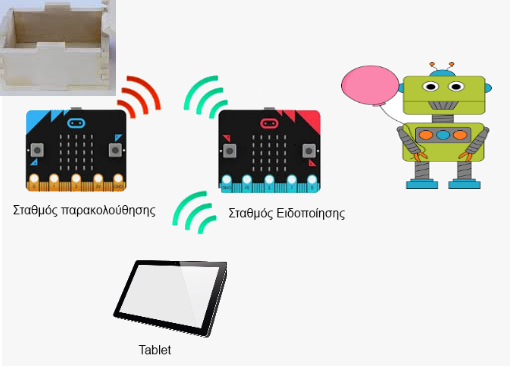

Θα δημιουργηθούν δυο φορητοί σταθμοί. Ένας σταθμός όπου θα καταγράφει  την ύπαρξη ενός ακραίου φυσικού φαινομένου και ένας άλλος σταθμός όπου θα μας ειδοποιεί. 
Οι δύο σταθμοί θα υλοποιηθούν με την χρήση πλακέτας Microbit  όπου θα επικοινωνούν μεταξύ τους. Ο σταθμός παρακολούθησης θα έχει ενσωματωμένους αισθητήρες πάνω σε μια ξύλινη μακέτα όπου θα γίνει η εξομοίωση των φυσικών καταστροφών
 
O σταθμός ειδοποιήσεις θα μπορεί να συνδεθεί ασύρματα με tablet ή κινητό (Διαδίκτυο των πραγμάτων).
Για την καταγραφή της στάθμης του νερού δεν θα χρησιμοποιηθούν έτοιμοι αισθητήρες του εμπορίου (αισθητήρα στάθμης υγρών). Με την χρήση απλών υλικών οι μαθητές θα φτιάξουν τους δικούς τους αισθητήρες στάθμης νερού. Θα μπορέσουν έτσι να καταλάβουν την λειτουργία των αισθητήρων, δημιουργία ενός ηλεκτρονικού κυκλώματος και θα μειωθεί το κόστος του Project. 

* **Περίπτωση υπερχείλισης ποταμού:** Στην περίπτωση υπερχείλισης ενός ποταμού ο σταθμός με την βοήθεια ενός αισθητήρα θα αντιλαμβάνεται το ύψος του νερού και θα στέλνει προειδοποιητικό σήμα στον δεύτερο σταθμό για την στάθμη του νερού . Αυτόματα θα γίνεται εκτροπή του περισσευούμενου νερού μέσω το άνοιγμα ενός αγωγού.
* **Περίπτωση σεισμού:** Από την στιγμή που η πλακέτα θα ανιχνεύει δόνηση θα στέλνει σήμα στο σταθμό ειδοποίησης.
### Υλοποίηση Project
Για την δημιουργία των δύο σταθμών θα χρησιμοποιηθεί η πλακέτα Μicrobit. Προτείνεται στην συγκεκριμένη περίπτωση για το χαμηλό κόστος, την ευκολία προγραμματισμού από μαθητές δημοτικού και της ενσωματωμένες δυνατότητες  όπου διαθέτει για την υλοποίηση του project (Bluetooth, Radio σήματα, αισθητήρα θερμοκρασίας, Led οθόνη)
Οι πλακέτες Μicrobit μπορούν να επικοινωνούν μεταξύ τους. Με την χρήση Radio σημάτων η μεταξύ επικοινωνία δυο Μicrobit μπορεί να φτάσει στα 70 μέτρα. Για να μεγαλώσουμε την απόσταση επικοινωνίας στο διάστημα που θέλουμε μπορούμε να χρησιμοποιήσουμε ενδιάμεσα και άλλες πλακέτες Μicrobit. Στο συγκεκριμένο project θα χρησιμοποιήσουμε 2 Μicrobit. Η αυτονομία ενός Μicrobit μια 2 μπαταρίες 1,5V χωρίς την χρήση αισθητήρων μπορεί να φτάσει και την μια εβδομάδα

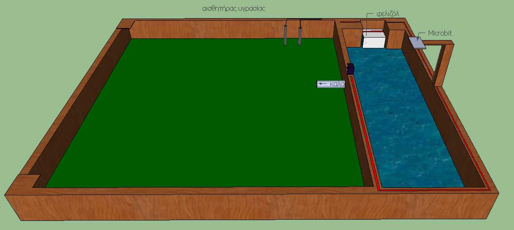
Σταθμός εξομοίωσης φυσικών φαινομένων
 
 Με την χρήση μακέτας θα γίνει η προσομοίωση των παραπάνω περιπτώσεων. Η μακέτα θα είναι χωρισμένη σε δύο μέρη. Το ένα μέρος θα αναπαριστά το δάσος και το άλλο ένα ποτάμι.  Ένα πλαστικό καλαμάκι θα προσομοιώνει τον αγωγό. 
Στα μακέτα πάνω θα υπάρχει η πλακέτα Μicrobit με τροφοδοσία μπαταρίας. 
* **Εξομοίωση πλημμύρας :** 

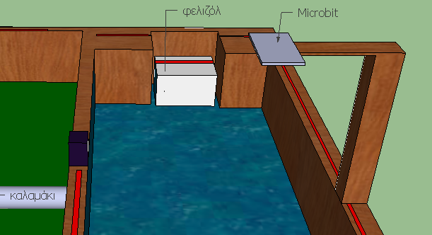

Στο δεξιό μέρος της μακέτας θα υπάρχει νερό όπου θα αναπαριστά ένα ποτάμι. Όταν προσθέσουμε νερό ένας μικρός κύβος από φελιζόλ θα υπερυψώνεται και θα κλείνει το κύκλωμα. Η πλακέτα Μicrobit θα αντιλαμβάνεται κλειστό κύκλωμα και θα στέλνει προειδοποιητικό μήνυμα στον δεύτερο σταθμό. Αυτόματα θα ανοίγει το καλαμάκι για να διοχετεύσει το επιπλέον νερό στο δάσος με την χρήση ενός μοτέρ Servo. Όταν μειωθεί η στάθμη του νερού το καλαμάκι θα κλείνει την ροή του νερού
* **Εξομοίωση σεισμού:** 

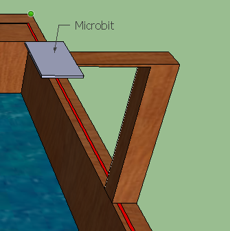

Η πλακέτα θα είναι τοποθετημένη πάνω σε ένα λεπτό ξύλο. Από την στιγμή που η πλακέτα θα ανιχνεύει μια δόνηση θα στέλνει σήμα στο σταθμό ειδοποίησης.

### Δημιουργία σταθμού ειδοποίησης
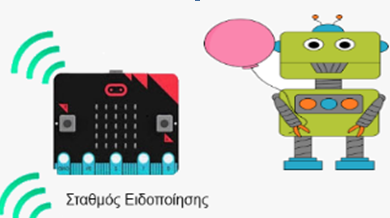

Ο σταθμός ειδοποίησης θα εμφανίζει τα επίπεδα υγρασίας, την ύπαρξη πλημμύρας  και την περίπτωση σεισμού στην οθόνη led.  Θα έχει μικρό ηχείο για να μας ειδοποιεί. Ο σταθμός λόγου του μικρού μεγέθους  του θα μπορεί να μετατραπεί σε φορητό ρολόι 
Colons can be used to align columns.
### Υλικά
1. BBC micro:bit Board 18,90χ2= 37,8
2. Μπαταριοθήκη 2xΑΑ με JST PH   0,40χ2= 0,80
3. Buzzer 2-5V 30mA  = 0,65
4. Hobby Motor - Gear = 2,40
5. Servo Micro 2.2kg.cm Plastic Gears  3,60x2=7,20
6. Jumper Wires 15cm Female to Male - Pack of 10 1,80χ2=3,6
7. Alligator Test Leads - Multicolored 10 Pack 3
8.

Σύνολο = 53

### Φωτογραφικό Υλικό
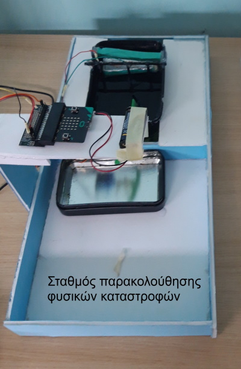
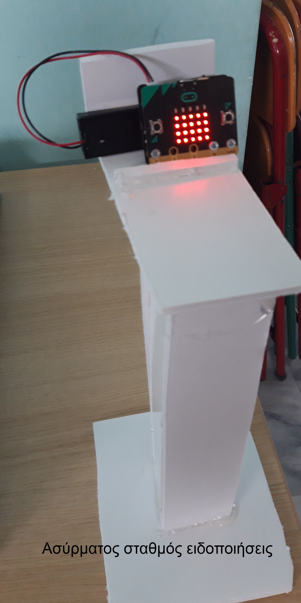
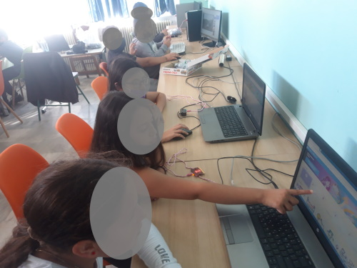
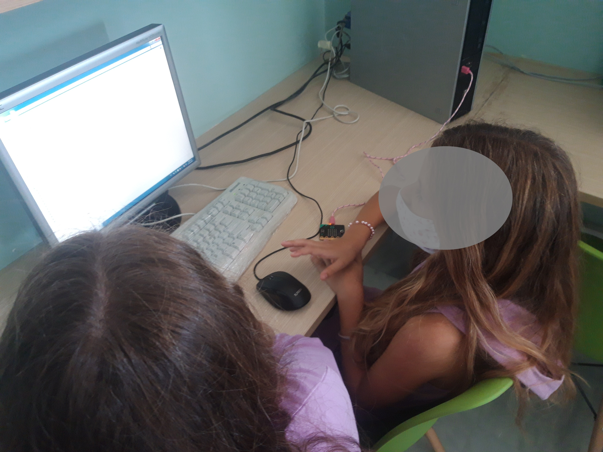
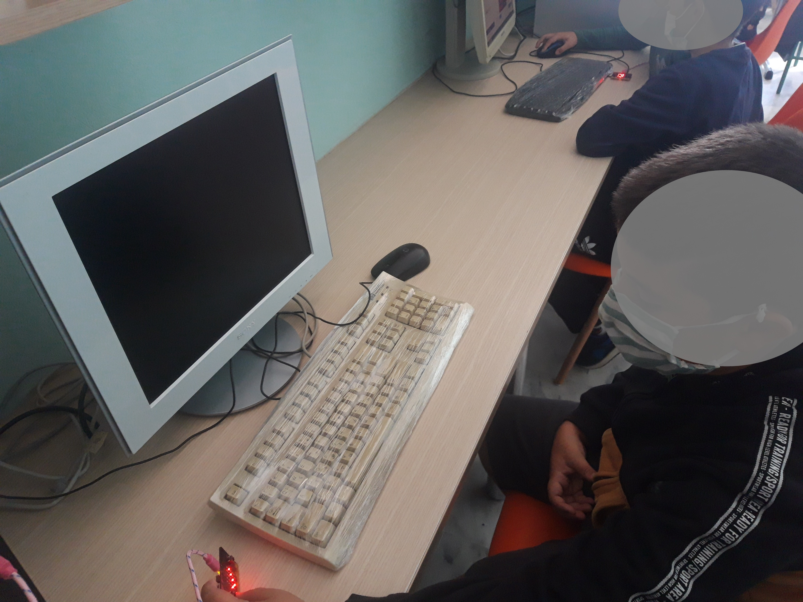
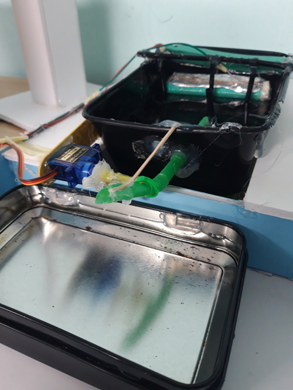
